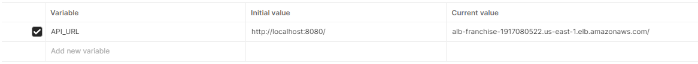

# App-Franchise

Bienvenido a App-Franchise, un proyecto desarrollado en Spring Boot con Maven y ejecutable mediante Docker. Esta aplicación gestiona franquicias, sucursales y productos, y utiliza una base de datos no relacional MongoDB. Sigue estos pasos para ejecutar la aplicación de manera local.

## Requisitos Previos

Asegúrate de tener instalados los siguientes componentes antes de comenzar:

- [Docker](https://www.docker.com/get-started)
- [Maven](https://maven.apache.org/download.cgi)
- [Postman](https://www.postman.com/downloads/)
- Git (opcional, pero recomendado para clonar el repositorio)


## Clonar el Repositorio

Si no has clonado el repositorio de App-Franchise, puedes hacerlo ejecutando el siguiente comando:

```bash
git clone https://github.com/DaniBonica001/app-franchise.git
cd app-franchise
```

## Colección de Postman

Para facilitar la interacción con la API de App-Franchise, hemos creado una colección de Postman que incluye diversos escenarios y casos de uso. Puedes importar esta colección en tu cliente de Postman siguiendo estos pasos:

1. Descarga el archivo JSON de la colección de Postman desde el siguiente enlace: [Colección de Postman JSON](https://drive.google.com/file/d/1QZEWVc9EE0KxFJVWKpupY1RBZNbmoS-r/view?usp=sharing) 
2. Abre Postman y haz clic en la pestaña "Import" en la parte superior izquierda.

3. Selecciona el archivo "Franquicia.postman_collection.json" en la ubicación de descarga.

4. Haz clic en "Import" para agregar la colección a tu entorno de Postman.


### Uso de la Colección

Una vez que hayas importado la colección, podrás acceder a diferentes escenarios y casos de uso relacionados con la gestión de franquicias, sucursales y productos en App-Franchise. Asegúrate de haber ejecutado la aplicación localmente o mediante un contenedor de Docker antes de probar los endpoints.

¡Explora y prueba la colección para conocer más sobre la API de App-Franchise!

### Ejecución en la nube

Actualmente la aplicación se encuentra desplegada en la nube de AWS con una infraestructura sencilla. Cuenta con los siguientes recursos:
- Pipeline de CI/CD implementado con CodePipeline, CodeBuild y CodeDeploy
- Load Balancer para distribuir el tráfico entre las instancias
- Recurso de ECS con Fargate para ejecutar la aplicación en contenedores, actualmente se tienen 2 instancias corriendo entre las que el balanceador de carga distribuye la carga
- MongoDB Atlas para la base de datos
- Parameter Store de AWS System Manager para el manejo de secretos de la aplicación

Para hacer uso del aplicativo desplegado en la nube, en Postman, en la colección de Franquicia, en la carpeta de "Variables", se debe cambiar la variable "API_URL" por la dirección del Load Balancer de AWS:
    
```bash
    alb-franchise-1917080522.us-east-1.elb.amazonaws.com/
   ```
